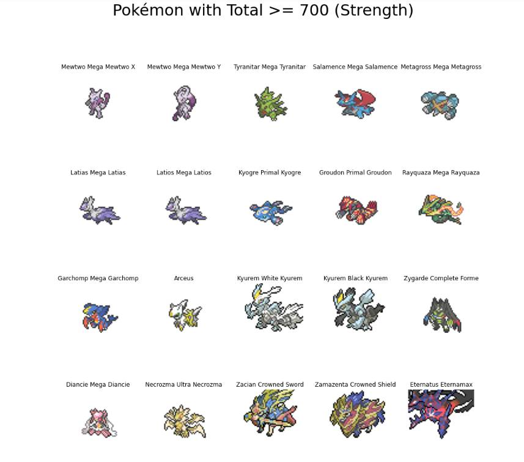
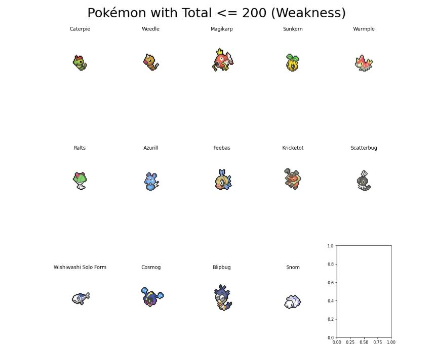
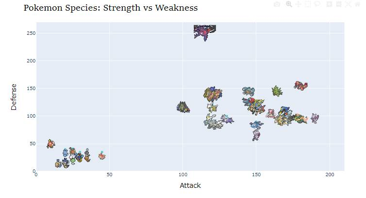
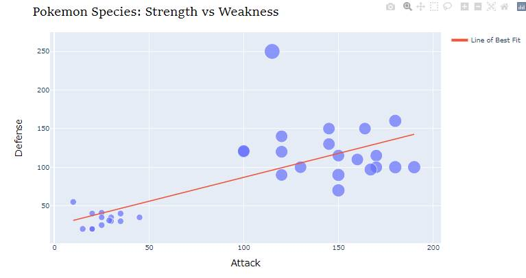

# Title: Pokémon - Unveiling the Top Strength and Weakest Contenders

## Introduction:
Welcome to the exciting world of Pokémon, where mystical creatures battle for supremacy! In this data visualization and storytelling project, we will explore the realm of Pokémon and delve into the data to discover the Top Strength and the Weakest contenders among them. With the vast array of species, each possessing unique abilities, we aim to unravel the mystery of their Total Strength and identify the Pokémon that stand out as powerhouses and those that require a little more nurturing to reach their full potential.

1. Unveiling the Top Total Strength:
Our journey begins by analyzing the data to uncover the most formidable Pokémon with the highest Total Strength. We will visualize and identify the top contenders in terms of Total stats, showcasing the powerhouses that reign supreme in the Pokémon world. Through captivating visualizations, you will witness the prowess of these extraordinary creatures, giving you an insight into their remarkable abilities and battle potential.

2. The Weakest Challengers:
As we explore the vast world of Pokémon, it is equally important to shine a light on those who may not possess extraordinary power but have unique qualities nonetheless. We will reveal the Pokémon with the lowest Total Strength, appreciating their distinct attributes and acknowledging their role in the grand tapestry of Pokémon diversity.

3. Discovering Strengths and Weaknesses:
To understand the factors contributing to a Pokémon's Total Strength, we will examine its individual attributes. Analyzing the Attack, Defense, Special Attack, Special Defense, and Speed attributes, we will visualize how they contribute to the overall strength of each Pokémon. By identifying patterns and relationships between these attributes, we aim to uncover the secrets of a Pokémon's prowess or weakness in battle.

4. Defense vs. Attack:
A critical aspect of a Pokémon's battle strategy lies in its Defense and Attack attributes. We will visualize the relationship between these two attributes for the Top Strength and Weakest Pokémon. By plotting the data points on a scatter plot, we can identify whether higher Attack values generally correspond to higher Defense values, and vice versa. This will give us valuable insights into the battle dynamics and potential strategies for success.

## Conclusion:
In this captivating exploration of Pokémon's Top Strength and Weakest contenders, we have delved into the data, revealing the extraordinary creatures that shine in battle and the unique ones that deserve appreciation in their own right. By visualizing and understanding the attributes that contribute to their prowess or weakness, we have gained deeper insights into the fascinating world of Pokémon.

Through storytelling with data visualization, we have brought to life the stories of these enchanting creatures, igniting a passion for further exploration and appreciation of their diverse abilities. As trainers, enthusiasts, and researchers, let us continue our quest to unlock the secrets of Pokémon and celebrate their individual strengths and uniqueness. Together, we embark on a journey of knowledge and wonder, embracing the captivating world of Pokémon.
