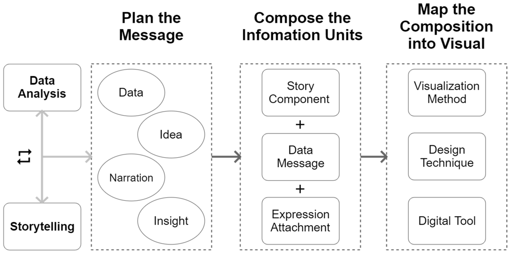

# tawesome-eda

# Data Story: Unveiling the World of Pokémon:  Exploring Types, Strengths, and Weakness

## Introduction
The world of Pokémon is full of captivating creatures with unique abilities and attributes. As Pokémon trainers, we strive to understand the strengths and weaknesses of different species to build formidable teams. In this data story, we will explore how a Pokémon's Attack and Defense attributes are related and how they determine its strength or weakness in battles.

## Workflow

                    Figure1: proposed overview of our visual data storytelling approach

## Data Exploration

- We studied the dataset and checked for missing values and inconsistences and filled type2 will none value since it has 500+ missing values
- Then, high the key attributes used for analysis (Type1, Type2, Total, HP, Attack, Defense, Sp. Atk, Sp. Def, Speed).

## Strengths and Weaknesses

- We consider pokemon with great strength and weakness as we choose to work with this characteristics by investigating battle statistics (Attack, Defense, Sp. Atk, Sp. Def, Speed) to identify strengths and weaknesses of Pokémon types.
- Create visualizations, such as bar charts or radar plots, to showcase the attributes of different Pokémon types.
- Selecting most powerful and least powerful using the Total types
- This lead us to our data story

## Conclusion:
Through our data analysis, we aim to uncover valuable insights that Pokémon trainers can use to develop strategic battle teams. By understanding the relationships between Attack, Defense, and Pokémon types, trainers can make informed decisions during battles and become true Pokémon masters.

## Libraries and Tools Used

- Pandas,   - Matplotlib,   - Seaborn,   - PIL
- Jupyter,   - Tableau

- Pandas: For data manipulation and preprocessing.
- Matplotlib and Seaborn: For data visualization, including the Attack vs. Defense plot.
- Seaborn: Built on top of Matplotlib, Seaborn offers a high-level interface for creating attractive statistical visualizations.
- Plotly: An interactive visualization library that supports creating interactive charts, plots, and dashboards. It offers a range of features for exploratory data analysis.
- Jupyter Notebook: Used for the step-by-step data exploration and analysis.
- Tableau: A comprehensive data visualization tool that allows you to create interactive dashboards, reports, and visualizations. It provides a user-friendly interface for both beginners and advanced users.
